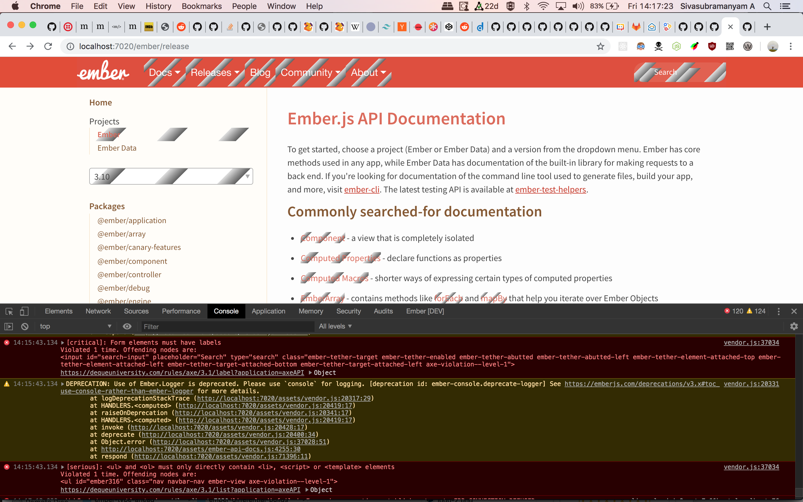
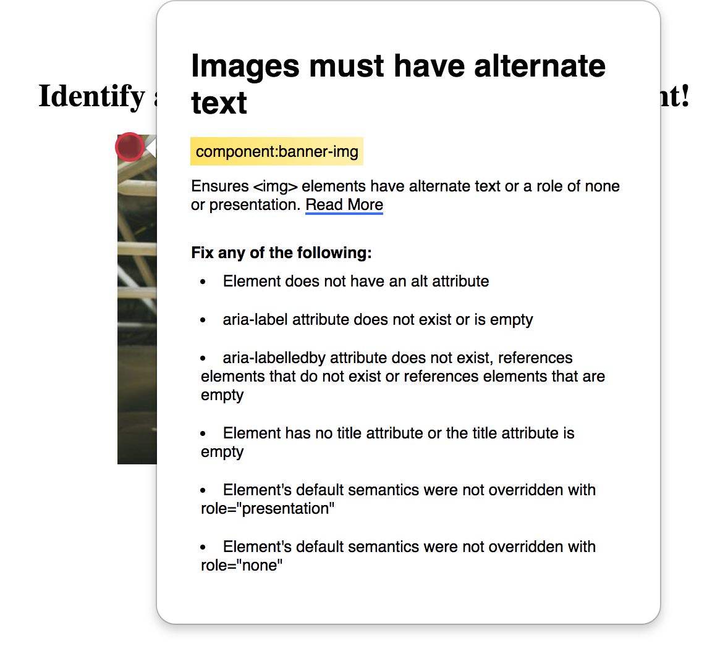

ember-accessibility
==============================================================================

An EmberJS addon to help identify accessibility violations.

This addon uses the [axe-core](https://github.com/dequelabs/axe-core) library
to audit your apps.

[DEMO](https://coyote-labs.github.io/ember-accessibility/)

Compatibility
------------------------------------------------------------------------------

* Ember.js v2.18 or above
* Ember CLI v2.13 or above
* Node.js v8 or above


Installation
------------------------------------------------------------------------------

```
ember install @coyote-labs/ember-accessibility
```


Usage
------------------------------------------------------------------------------

* In your application template, include the **AccessibilityTester** component.
  For example,
  ```handlebars
  <h1>Welcome to my app!</h1>
  <AccessibilityTester />
  ```
* In your `config/environment.js`, provide an `ember-accessibility` object that has
  the following fields.

  `isEnabled`: Defaults to `false`. You can set it to `environment === 'development'`.
  This addon's code will be stripped unless this is set to `true`.

  `axe`: Allows configuring axe-core. Refer axe-core's [documentation](https://www.deque.com/axe/axe-for-web/documentation/api-documentation/#options-parameter).

  ```javascript
  // config/environment.js
  let ENV = {
    'ember-accessibility': {
      isEnabled: environment === 'development',
      axe: {
        restoreScroll: true
      }
    }
  };
  ```
* Click on the **Check Accessiblity** button that appears when you visit the app.
* Fix the errors that are displayed and make your app accessible!

  

**Using in engines**

* Make sure you add `ember-accessibility` to the engine's dependencies.
* Add the `accessibility-test` service to your engine's dependencies in `app.js`.


**Using in test**

- Import `accessibilityTester` async function from `'@coyote-labs/ember-accessibility/test-support/audit';` and then call it.

> Note: Same config passed in `config/environment.js` will be applied here.

##### Acceptance Tests

```javascript
import accessibilityTester from '@coyote-labs/ember-accessibility/test-support/audit';

test('Checks accessibility violations', function(assert) {
  visit('/');
  assert.notOk(await accessibilityTester());
});
```
Or you can pass any selector from the visited page.

```javascript
import accessibilityTester from '@coyote-labs/ember-accessibility/test-support/audit';

test('Checks accessibility violations', function(assert) {
  visit('/');
  assert.notOk(await accessibilityTester('#someID'));
});
```
##### Integration / Unit Tests

```javascript
import accessibilityTester from '@coyote-labs/ember-accessibility/test-support/audit';

test('Checks accessibility violations in component', function(assert) {
  await render(hbs`<AccessibilityTester />`);  
  assert.notOk(await accessibilityTester(this.element));
});
```

How is this different from [ember-a11y-testing](https://github.com/ember-a11y/ember-a11y-testing)?
------------------------------------------------------------------------------

ember-a11y-testing is primarily geared towards testing *as of now*. While this
will most definitely change, we wanted something that will provide contextual
and meaningful feedback to developers during the development phase itself.

For example, here is how ember-a11y-testing looks in development currently.



Notice how all the errors are present on the console. This addon on the other hand
will make it easier to comprehend those errors.



Another major reason that we wrote this addon is because our tests became
extremely slow when using ember-a11y-testing. This is a major pain point when
using it on large projects. By doing a11y testing in development and review
phases, we were able to avoid that.


Contributing
------------------------------------------------------------------------------

See the [Contributing](CONTRIBUTING.md) guide for details.


License
------------------------------------------------------------------------------

This project is licensed under the [MIT License](LICENSE.md).
